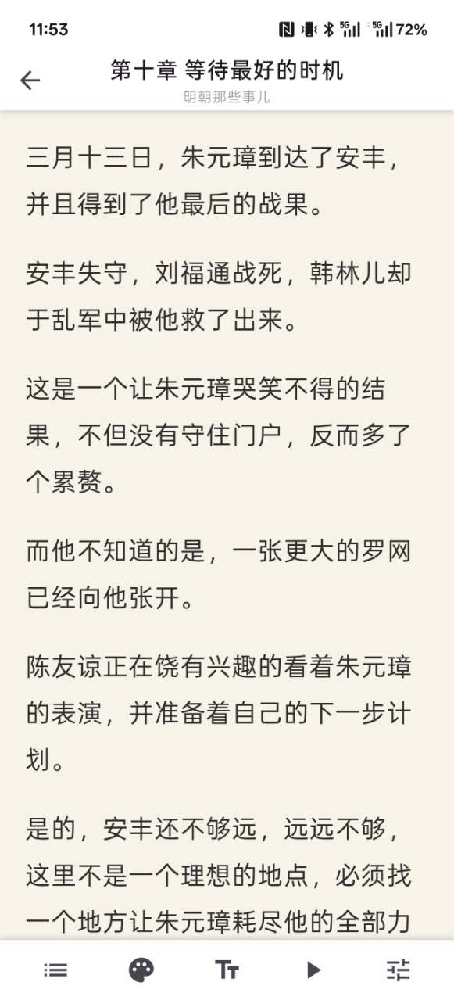
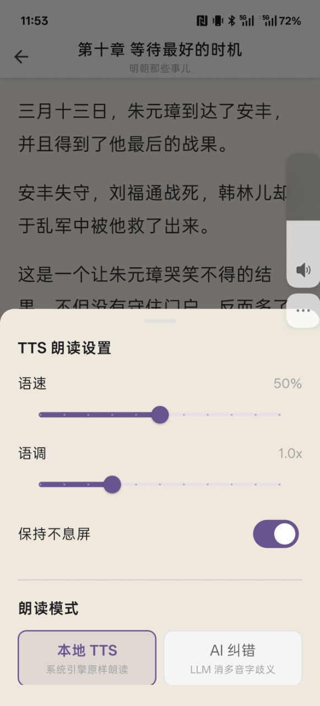

# SwingTell

**AI-powered personal reading & information platform**

> **用魔法打败魔法，用 AI 对抗 AI。**  
> 当全网都在用 AI 生产屎的时候，我用 AI 给自己搭一座信息茧房。

---

现在的视频网站已经没法看了。

AI 画个大字报封面图，白底红字黄字，标题怎么惊悚怎么来——点进去 30 分钟"精读"一本书，屎一样的 AI 配音配屎一样的 AI 视频。以前刷两三个小时短视频也不觉得烦，现在翻标题半小时，一个都不想点。

就算刨掉 AI 作品，非 AI 的也一样卷得反胃。冷知识、底层逻辑、核心力量、熟成牛排、信息差——看见这些词就腻。

所以我写了这个东西。

> ⚠️ **背景说明**：作者 Flutter / Dart 零基础，AI 辅助开发。
> 代码能跑但不优雅，欢迎有经验的开发者参与重构、指导或直接骂醒。
> PR 和 Issue 都欢迎，架构讨论尤其需要。

用 AI 的所有手段，反向加固自己的信息茧房。AI 产出的垃圾不想看？那就让 AI 帮我把想看的筛出来、读出来、聊出来。

---

## 截图

| | | |
|:-:|:-:|:-:|
|  |  |  |
| 首页 | 书架 | 阅读器 |
|  |  |  |
| LLM 多音字校正 | AI 新闻总结 | 世界线变动 |

---

## 功能

| 模块 | 状态 | 描述 |
|------|------|------|
| **AI 朗读** | 🟡 勉强能用 | EPUB 听书 + LLM 多音字校正，至少不会把"行"全读成 xíng |
| **AI 角色聊天** | 🟡 就那么回事 | 自定义角色 + 流式对话，纯自娱自乐 |
| **AI 新闻总结** | 🟡 勉强能用 | RSS 聚合 + AI 摘要，茧房总得留扇窗 |
| **世界线变动** | 🟢 做了个开头 | 穿越回某个时间点，亲历那个时代。信源有限，经常啥也查不到 |

### AI 朗读 (TTS 听书)

- EPUB 导入，自动解析书名、作者、封面
- 双引擎 TTS（flutter_tts → 原生 TTS 自动回退）
- 选段播放：点哪从哪读
- 滚动跟随 + 当前句高亮
- 无感翻章，不打断播放
- 语速 / 音高调节，屏幕常亮
- **LLM 多音字校正**：把文本发给 LLM 做上下文消歧，同音替代字替换，让 TTS 不再念白字

### AI 角色聊天

- 创建角色（名字 + 系统提示词）
- 流式 SSE 对话，兼容 OpenAI API
- 角色 / 会话本地持久化
- 角色导入导出（`.echar` 格式，带头像 + 聊天记录）

### AI 新闻总结

- RSS 订阅聚合
- AI 自动摘要生成
- 信息茧房留个透气孔

### 世界线变动（开发中）

- 设定时间点，穿越回到那个时代
- 搜索 / 浏览当时的信息
- 目前信源有限，勉强不崩

### 阅读体验

- WebView HTML 渲染，原生滚动
- 4 种护眼主题：暖纸 / 暗夜 / 绿荫 / 羊皮
- 字体样式 / 字号自由调节
- 进度自动保存（章节 + 偏移 + 百分比）
- 章节列表快速跳转

---

## 技术栈

| 层次 | 技术 |
|------|------|
| 语言 / 框架 | Dart 3.11+ / Flutter (Material 3) |
| 状态管理 | Provider + ChangeNotifier |
| EPUB 解析 | epubx |
| 内容渲染 | webview_flutter |
| 本地存储 | Hive (NoSQL) |
| TTS | flutter_tts + Android 原生 TTS (MethodChannel) |
| AI | OpenAI 兼容 API (HTTP streaming) |
| 文件选择 | file_picker |
| 屏幕常亮 | wakelock_plus |

---

## 项目结构

```
lib/
├── main.dart                  # 入口
├── app.dart                   # MaterialApp + 路由
├── core/
│   ├── constants/             # 颜色主题
│   ├── models/                # 数据模型
│   └── services/
│       ├── storage_service.dart
│       ├── progress_service.dart
│       ├── settings_service.dart
│       ├── epub_service.dart
│       ├── chat_service.dart
│       ├── chat_storage_service.dart
│       └── tts/
│           ├── tts_pipeline.dart
│           ├── tts_pipeline_impl.dart
│           ├── tts_text_corrector.dart
│           ├── native_tts.dart
│           ├── llm_correction_worker.dart
│           └── correction_ring_buffer.dart
├── features/
│   ├── home/
│   ├── bookshelf/
│   ├── reader/
│   ├── chat/
│   └── settings/
└── shared/widgets/
```

---

## 快速开始

```bash
flutter pub get
dart run build_runner build --delete-conflicting-outputs
flutter run

# 构建
flutter build apk        # Android
flutter build ios        # iOS
flutter build windows    # Windows
flutter build linux      # Linux
flutter build macos      # macOS
```

> Android 11+ 上 `flutter_tts` 可能因包可见性限制无法发现 TTS 引擎，系统会自动回退到原生 TTS。

---

## 依赖

`epubx` · `webview_flutter` · `hive` / `hive_flutter` · `flutter_tts` · `provider` · `http` · `file_picker` · `wakelock_plus` · `share_plus` · `image` · `archive` · `xml` · `url_launcher`

---

## 许可证

MIT
